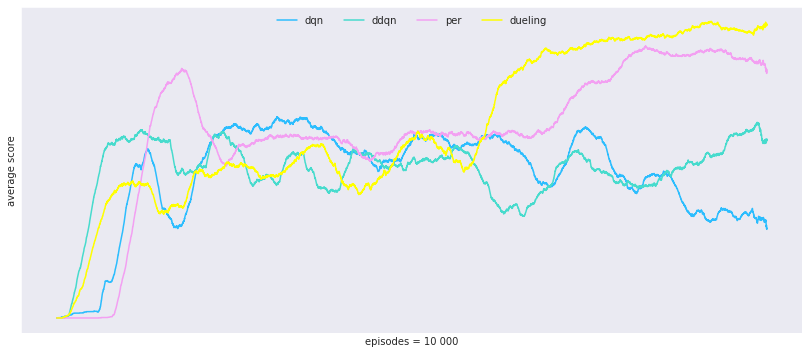
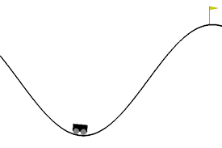

# Rainbow

## Table of contents

1. Introduction
2. Code comments
3. Problem description
4. RL principles
5. Implementation notes
6. Results
7. Todo

## 1 - Introduction

The objective was to implement the components of the deep reinforcement learning algorithm Rainbow separately, and then to put those pieces together from scratch into the actual Rainbow.

The environment of choice landed on MountainCar in OpenAI gym, more on that below.

Here follows the articles of each respective contribution to Rainbow. During this project i managed to implement all of them except NoisyDQN.

* Rainbow: [Rainbow: Combining Improvements in Deep Reinforcement Learning](https://arxiv.org/abs/1710.02298)
* Original DQN: [Playing Atari with Deep Reinforcement Learning](https://arxiv.org/abs/1312.5602)
* Double DQN: [Deep Reinforcement Learning with Double Q-learning](https://arxiv.org/abs/1509.06461)
* Multi-step DQN (Sutton Barto RL textbook): [Sutton and Barto RL textbook chapter 7](https://web.stanford.edu/class/psych209/Readings/SuttonBartoIPRLBook2ndEd.pdf)
* Prioritized experience replay DQN: [Prioritized Experience Replay](https://arxiv.org/abs/1511.05952)
* Dueling DQN: [Dueling Network Architectures for Deep Reinforcement Learning](https://arxiv.org/abs/1511.06581)
* c51 / Distributional DQN: [A Distributional Perspective on Reinforcement Learning](https://arxiv.org/abs/1707.06887)
* Noisy DQN: [Noisy Networks for Exploration](https://arxiv.org/abs/1706.10295)

## 2 - Code comments

In Train.ipynb lies the necessary parts to train all of the agents, simply enter the agent name of choice, set hyperparameters and run the code.

In Helpers.ipynb lies the core components of these algorithms., here is a short description of its contents:
* DqnAgents class: methods that build the various networks aswell as all of the algorithms parameter update procedures.
* SumTree class: builds the sum tree data structure that is used by the prioritized experience replay.
* PrioritizedExperienceReplay class: methods implementing the prioritized replay.
* ExperienceReplay: the regular replay buffer.

## 3 - Problem description

The discrete MountainCar problem can be described as follows.

A car moves along a 1-dimensional space by moving forward, backward, or not at all. The goal is to get to the top of the hill. The engine is not strong enough to make it in one try though, so the agent needs to deviate from the goal in order to build up some momentum.

The problem can be formulated as a Markov decision problem, where the state is continuous and represented by a 2-dimensional vector, which in turn represents the car's position and velocity. The action space is discrete and consists of 3 actions. The reward is -1 for each timestep until the goal is reached. The problem is naturally divided into episodes with a terminal state either when the goal is reached, or when 200 timesteps have passed.

## 4 - RL principles

We can not represent the value function in a table due to the continuous nature of the state space which means we are looking at an approximation of the value function. Furthermore, since the task is episodic we will not use the average reward as our objective. Rather, assuming for now that we restrict ourselves to consider the task merely as a prediction problem, we could be looking at Gradient Monte Carlo on an episodic basis, and Semi Gradient TD on a timestep one. From here if we want to consider it as a control problem, we can throw in Q learning, Sarsa, and expected Sarsa in the mix.

We might also, if we like, learn a policy directly by parameterizing it. Let's wait with the policy gradients for this problem though. 

Are we looking towards predicting state value or action values? Well, if we are pursuing to improve an actual policy, we will need action values to do that. Then we are looking at Q learning, Sarsa and Expected Sarsa. Although, since Sarsa is more of a policy evaluation algorithm, evaluating action values under a specific policy, it seems a bit off. I mean, since we don't want to hassle with specific policies, we want the optimal policy. Enter Q learning. 

Explore / exploit. Let's tend ourselves towards the use of the epsilon greedy policy strategy. That is, if you draw a random number below epsilon, take a random uniform action. Else take a greedy action. Later we can build in the exploring parts of the agent directly into the policy parameterization, but more on that later.

When it comes to state representation, since we are dealing with a continuous state space, we have either tile coding or neural networks in our tool belt. But let's recap what it is that we are after in our state representations. We want them to be able to generalize a lot. We also want them to be able to discriminate between states. Spontaneously, the larger the state space, the more sense it makes to go neural networks. We are going to go with neural networks.

## 5 - Implementation notes

There are some implementation notes to be found in a notebook [here](https://github.com/DemaciaLarz/Rainbow/blob/master/Implementation_Notes.ipynb)

## 6 - Results

You can find plots of all the results [here](https://github.com/DemaciaLarz/Rainbow/blob/master/Results.ipynb).

## 7 - Todo

* Implement the Noisy DQN.
* Put it all together and implement Rainbow from scratch.
